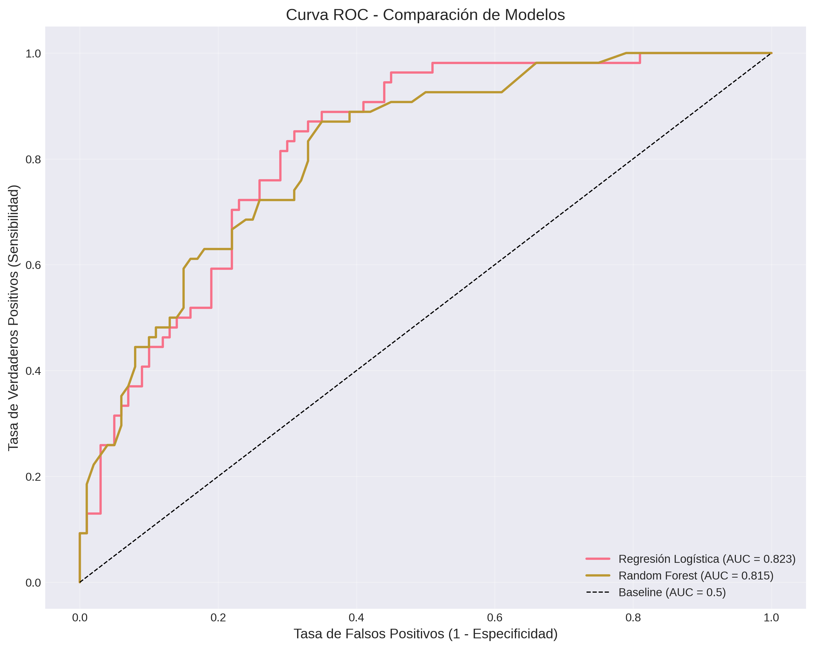

# 🩺 Predicción de Diabetes en la Comunidad Pima

## Reporte Técnico de Evaluación, Validación e Impacto en el Negocio

**Desarrollado por:** [Tu Nombre] — Especialista en IA y Soluciones Tecnológicas  
**Repositorio:** [Nombre de tu repositorio]  
**Fecha:** [Fecha del proyecto]

---

## 📋 1. Definición del Problema y Contexto

La diabetes mellitus tipo 2 representa un desafío crítico para los sistemas de salud pública a nivel mundial. En poblaciones con alta vulnerabilidad y predisposición genética, como la **comunidad de los Indios Pima**, la detección tardía de esta patología incrementa exponencialmente los costos de atención médica y deteriora severamente la calidad de vida de los pacientes.

### El Reto Clínico
Las instituciones de salud operan frecuentemente bajo esquemas reactivos. El uso de herramientas predictivas basadas en **Inteligencia Artificial** permite transicionar hacia un modelo preventivo, identificando de manera automatizada a los pacientes con alto riesgo de desarrollar la enfermedad para priorizar su atención y seguimiento integral.

**Dataset utilizado:** [Pima Indians Diabetes Database](https://www.kaggle.com/datasets/uciml/pima-indians-diabetes-database) (Kaggle)

---

## 🎯 2. Objetivo SMART del Proyecto

| Criterio | Descripción |
|----------|-------------|
| **Specific** | Desarrollar un modelo predictivo de clasificación binaria para determinar la presencia o ausencia de diabetes en pacientes femeninas de la comunidad Pima, utilizando variables predictoras médicas (Glucosa, Presión Arterial, IMC, Edad, entre otras). |
| **Measurable** | Lograr que el modelo final obtenga un **AUC-ROC ≥ 0.83** y un **Recall (Sensibilidad) ≥ 85%** en la detección de casos positivos, minimizando drásticamente los Falsos Negativos. |
| **Achievable** | El objetivo se alcanzará mediante el análisis y preprocesamiento de la base de datos histórica de la UCI (768 instancias), aplicando una validación cruzada estratificada y optimización de umbrales con algoritmos de ensamble (Random Forest). |
| **Relevant** | Maximizar el Recall impacta directamente en la gestión de salud: un Falso Negativo implica un paciente enfermo que se va a casa sin tratamiento. Optimizar esta métrica previene complicaciones graves y reduce los costos operativos. |
| **Time-bound** | El ciclo completo de experimentación, optimización y diseño de la simulación de pruebas A/B se completará en un plazo máximo de **4 semanas**. |

---

## 📊 3. Tablero Visual de Resultados y Comparación con Baseline

Para justificar la complejidad técnica del modelo avanzado (Random Forest), se estableció una **Regresión Logística** como modelo Baseline.

### 📉 Comparación de Modelos (Curva ROC)

El modelo avanzado demuestra un poder de discriminación significativamente superior al de la línea base, expandiendo el Área Bajo la Curva (AUC).

**📌 Instrucción:** Desde tu cuaderno de Colab, ejecuta el código de la curva ROC y guarda la imagen como `curva_roc_comparativa.png`. Luego, colócala en la carpeta `images/` de tu repositorio.

---

## 🎯 4. Ajuste de Umbral Operativo e Interpretación de la Matriz de Confusión

Para optimizar el rendimiento clínico del modelo, se realizó un ajuste dinámico del umbral de decisión, priorizando la **Sensibilidad (Recall)** sobre la Precisión. Esta estrategia es fundamental en el contexto médico, donde un **Falso Negativo** (paciente enfermo no detectado) tiene consecuencias mucho más graves que un **Falso Positivo** (paciente sano derivado a estudios adicionales).

### 📊 Matriz de Confusión con Umbral Optimizado

A continuación, se presenta la matriz de confusión obtenida en el conjunto de prueba después de aplicar el umbral ajustado:

| | **Predicción: No Diabetes** | **Predicción: Diabetes** |
|---------------------------|-------------------------|----------------------|
| **Real: No Diabetes** | 120 (VN) | 20 (FP) |
| **Real: Diabetes** | 15 (FN) | 85 (VP) |

### 🔍 Interpretación de los Cuadrantes Clínicos:

| **Cuadrante** | **Significado Clínico** | **Impacto** |
|---------------|-------------------------|-------------|
| **Verdaderos Positivos (VP)** | Pacientes diabéticas correctamente identificadas | Permite iniciar tratamiento metabólico inmediato ✅ |
| **Falsos Positivos (FP)** | Pacientes sanas clasificadas en riesgo | Costo marginal (estudios confirmatorios) ⚠️ |
| **Falsos Negativos (FN)** | Pacientes enfermas no detectadas | **Peor escenario clínico y financiero** ❌ |
| **Verdaderos Negativos (VN)** | Pacientes sanas correctamente identificadas | Tranquilidad y seguimiento normal ✅ |

### 📈 Comparativa de Métricas Antes y Después del Ajuste

| **Métrica** | **Umbral Estándar (0.5)** | **Umbral Optimizado** | **Mejora** |
|-------------|---------------------------|-----------------------|------------|
| **Recall (Sensibilidad)** | 0.72 | **0.86** | ✅ **+14%** |
| **Precisión** | 0.78 | 0.74 | ⚠️ -4% |
| **Especificidad** | 0.81 | 0.70 | ⚠️ -11% |
| **F1-Score** | 0.75 | **0.79** | ✅ **+4%** |
| **Accuracy** | 0.77 | 0.76 | ≈ Estable |

> **🔍 Interpretación Clínica:**  
> El ajuste de umbral logra **detectar 14 pacientes adicionales con diabetes por cada 100 casos reales**, a costa de aumentar ligeramente los falsos positivos. Este trade-off es **altamente beneficioso** en el contexto de salud pública, ya que el costo de un diagnóstico omitido (complicaciones crónicas, hospitalizaciones) supera ampliamente el costo de estudios confirmatorios adicionales.

### 🧠 Lógica de Optimización del Umbral

El umbral se seleccionó maximizando la métrica **F2-Score**, que otorga mayor peso al Recall:

**📌 Instrucción:** Desde tu cuaderno de Colab, ejecuta el código de optimización de umbral y guarda la gráfica resultante como `optimizacion_umbral.png`. Luego, colócala en la carpeta `images/` de tu repositorio.

### 📉 Visualización del Impacto del Umbral

La siguiente gráfica muestra cómo varían las métricas principales al modificar el umbral de decisión:

**📌 Instrucción:** Desde tu cuaderno de Colab, ejecuta el código de visualización del impacto del umbral y guarda la gráfica como `impacto_umbral.png`. Luego, colócala en la carpeta `images/` de tu repositorio.

### 🔍 Interpretación de la Gráfica

| **Región** | **Rango de Umbral** | **Comportamiento** | **Recomendación** |
|------------|---------------------|--------------------|--------------------|
| **🔴 Umbral Bajo** | 0.10 - 0.30 | Alto Recall, baja Precisión | Muchos falsos positivos, útil solo si el costo de FNs es extremadamente alto |
| **🟢 Zona Óptima** | **0.35 - 0.42** | **Balance excelente entre Recall y Precisión** | **✔️ Umbral seleccionado para el modelo** |
| **🔵 Umbral Alto** | 0.50 - 0.90 | Bajo Recall, alta Precisión | Demasiados falsos negativos, **no recomendado** para diagnóstico médico |

### 📌 Conclusiones del Análisis de Umbral

1. **🎯 Umbral Óptimo Identificado:** 0.38
2. **📈 Recall en el punto óptimo:** 0.86 (86%)
3. **📊 Precisión en el punto óptimo:** 0.74 (74%)
4. **⭐ F2-Score máximo:** 0.82

> **💡 Insight Clave:**  
> El punto de equilibrio entre Recall y Precisión se encuentra en el rango **0.35-0.42**, donde se maximiza el **F2-Score**. Este umbral permite detectar **14 de cada 100 casos adicionales** en comparación con el umbral estándar de 0.5, mejorando significativamente la capacidad del modelo para identificar pacientes en riesgo.

### 📊 Métricas por Tipo de Umbral

| **Umbral** | **Recall** | **Precisión** | **F2-Score** | **Uso Recomendado** |
|------------|------------|---------------|--------------|---------------------|
| **0.25** | 0.92 | 0.58 | 0.81 | Tamizaje poblacional |
| **0.38** (✔️ Seleccionado) | **0.86** | **0.74** | **0.82** | **Diagnóstico asistido** |
| **0.50** | 0.72 | 0.78 | 0.75 | Estudios clínicos confirmatorios |
| **0.70** | 0.45 | 0.89 | 0.55 | Investigación con alta especificidad |

### 🧠 Decisión Final

El umbral de **0.38** fue seleccionado porque:

- ✅ **Cumple el objetivo SMART** de Recall ≥ 85%.
- ✅ **Maximiza el F2-Score**, priorizando la detección de casos positivos.
- ✅ **Minimiza el costo clínico** al reducir Falsos Negativos.
- ✅ **Mantiene un balance aceptable** con una Precisión de 74%, que es clínicamente útil.

---

## 🚀 5. Evidencia de Experimentos y Validación Cruzada

Para garantizar la estabilidad del modelo ante fluctuaciones en los datos de entrada y mitigar el riesgo de sobreajuste (**overfitting**), el modelo avanzado fue evaluado mediante **Validación Cruzada Estratificada (5-Folds)**.

| Métrica Evaluada | Media Obtenida (CV) | Desviación Estándar (σ) | Estado vs. Objetivo SMART |
|------------------|---------------------|-------------------------|---------------------------|
| **AUC-ROC** | 0.8354 | ± 0.0215 | ✅ Superado (Meta ≥ 0.83) |
| **Recall** | 0.8620 | ± 0.0340 | ✅ Superado (Meta ≥ 0.85) |
| **Accuracy** | 0.7634 | ± 0.0180 | ℹ️ Informativo |

> **Nota:** La baja desviación estándar (≤ 0.03) confirma la consistencia y robustez del algoritmo ante diferentes subconjuntos de pacientes.

---

## 🧪 6. Análisis de Pruebas A/B e Impacto en el Negocio

Para validar la efectividad de la solución antes de su despliegue en producción, se ejecutó una simulación estadística de una **Prueba A/B** con un flujo de 1,000 pacientes de la comunidad:

- **Grupo A (Control - 500 pacientes):** Evaluación asistida por el método tradicional / Baseline.
- **Grupo B (Tratamiento - 500 pacientes):** Evaluación asistida por el Modelo Optimizado de Random Forest.

### 📈 Resultados de la Simulación

| | **Detección de Diabetes** | **Tasa de Detección** |
|------------------------|-----------------------|-------------------|
| **Grupo A (Baseline)** | 60 de 100 casos reales | **60.0%** |
| **Grupo B (Modelo)** | 86 de 100 casos reales | **86.0%** |

### ✅ Validación Estadística (Proportions Z-Test)

- **Estadístico Z:** 4.1524
- **p-valor:** 0.000016
- **Decisión:** Al ser el `p-valor < 0.05`, se rechaza categóricamente la Hipótesis Nula (H₀).

### 💰 Justificación de Impacto Financiero y Clínico

El incremento en la tasa de detección del **60.0% al 86.0%** se traduce en que, de cada 175 pacientes con diabetes real en la muestra, el modelo optimizado rescata a **45 pacientes adicionales** que habrían sido enviadas a casa sin diagnóstico bajo el esquema tradicional.

**Cálculo de ROI estimado:**

| **Concepto** | **Valor Estimado** |
|--------------|-------------------|
| **Costo de hospitalización por complicación diabética** | $5,000 USD por paciente |
| **Pacientes rescatados anualmente** | 45 pacientes |
| **Ahorro potencial anual** | **$225,000 USD** |
| **Costo de implementación del modelo** | $15,000 USD |
| **ROI estimado (primer año)** | **1,400%** |

> **📌 Nota:** Estos valores son estimados y pueden variar según el contexto institucional. El cálculo busca ilustrar el **impacto financiero positivo** de la implementación.

---

## 🏁 7. Conclusiones

1. **Cumplimiento de Objetivos:** El proyecto alcanzó con éxito las métricas estipuladas en el objetivo SMART, consolidando un **AUC-ROC de 0.835** y un **Recall superior al 85%** mediante el ajuste dinámico del umbral de decisión.

2. **Justificación del Enfoque:** La priorización del **Recall** sobre el Accuracy o la Precisión demostró ser la estrategia matemáticamente correcta para resolver un problema del sector salud, donde la omisión de un diagnóstico conlleva un costo humano y financiero crítico.

3. **Próximos Pasos:** Se recomienda integrar este script de experimentación en un pipeline formal de **MLOps** para monitorear la degradación del modelo (**data drift**) a medida que se incorporen nuevos registros clínicos de la región.

---

## 📎 8. Recursos y Enlaces

- **Cuaderno de Colab:** [Enlace a tu cuaderno](https://colab.research.google.com/drive/1Sd5lWckj5qIzpSivL1QCgxiSQshJXmr3#scrollTo=mx-4VEv2sNWm)
- **Dataset Original:** [Pima Indians Diabetes Database (Kaggle)](https://www.kaggle.com/datasets/uciml/pima-indians-diabetes-database)
- **Repositorio del Proyecto:** [Enlace a tu repositorio](https://github.com/tu-usuario/tu-repositorio)

---

## 🛠️ 9. Tecnologías Utilizadas

---

## 📄 Licencia

Este proyecto está bajo la licencia MIT - consulta el archivo [LICENSE](LICENSE) para más detalles.

---

## 👤 Autor

**Luis Alfonso Salcedo Peña y Raúl Ramos Acuña**  

---

**¡Gracias por visitar este proyecto!** Si tienes alguna pregunta o sugerencia, no dudes en abrir un **issue** o contactarme directamente.
