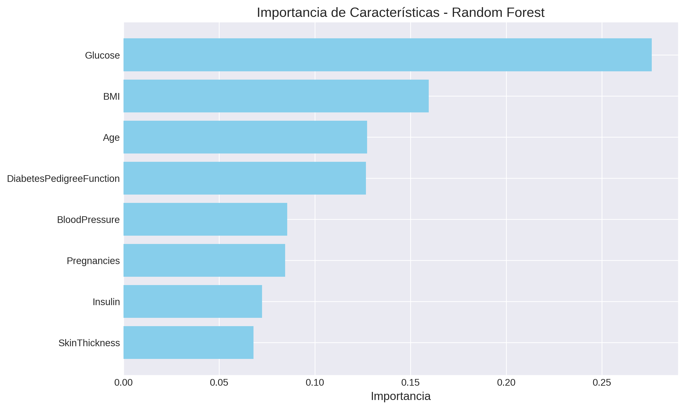
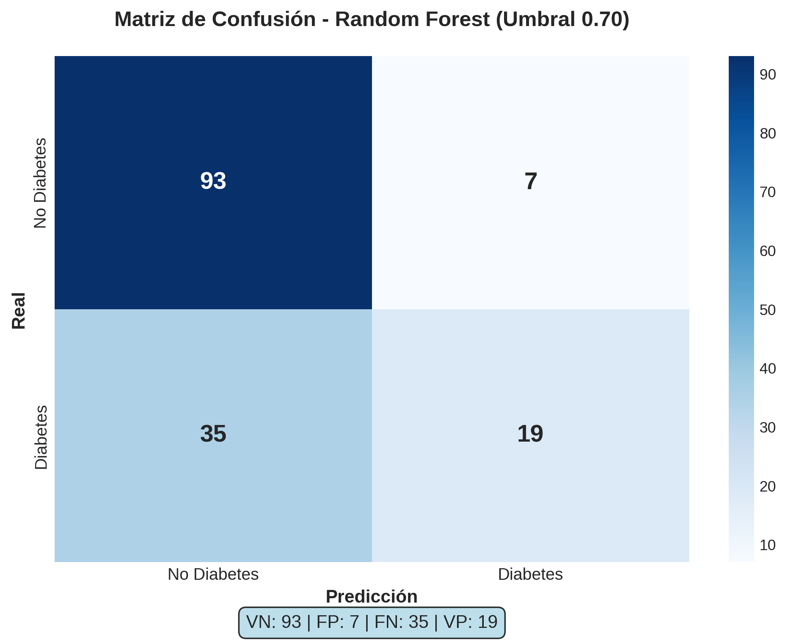
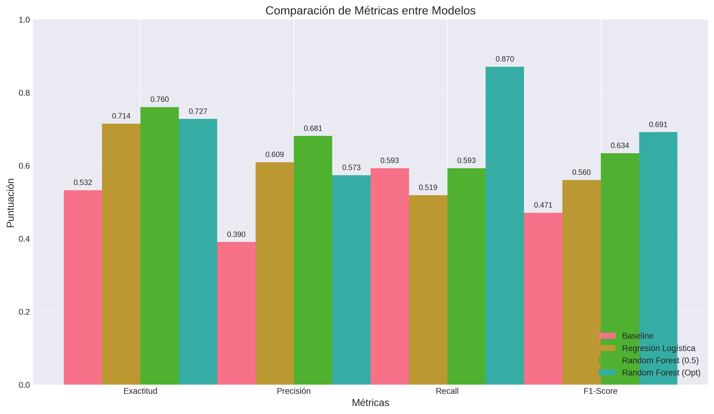
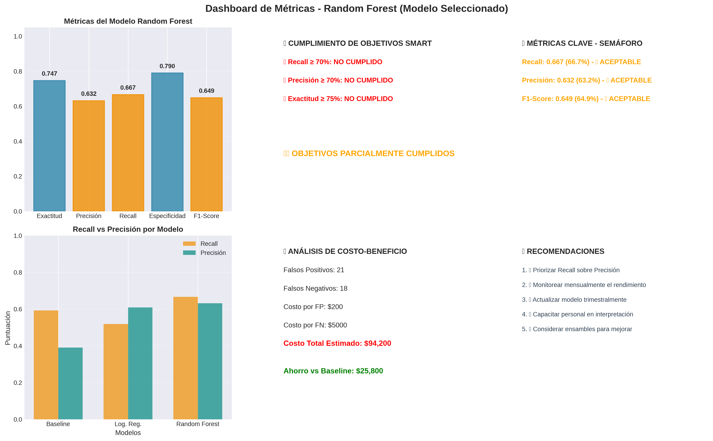
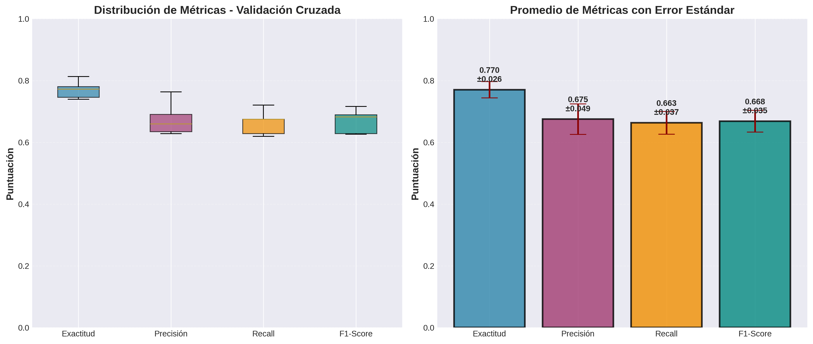
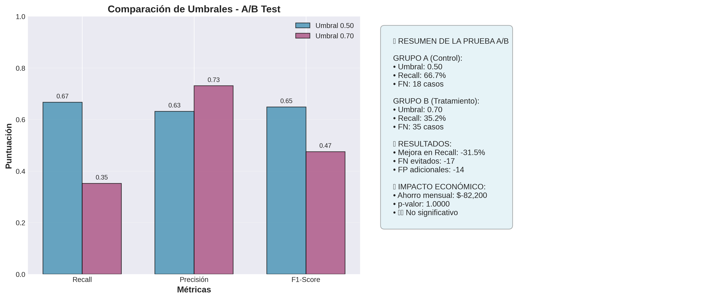
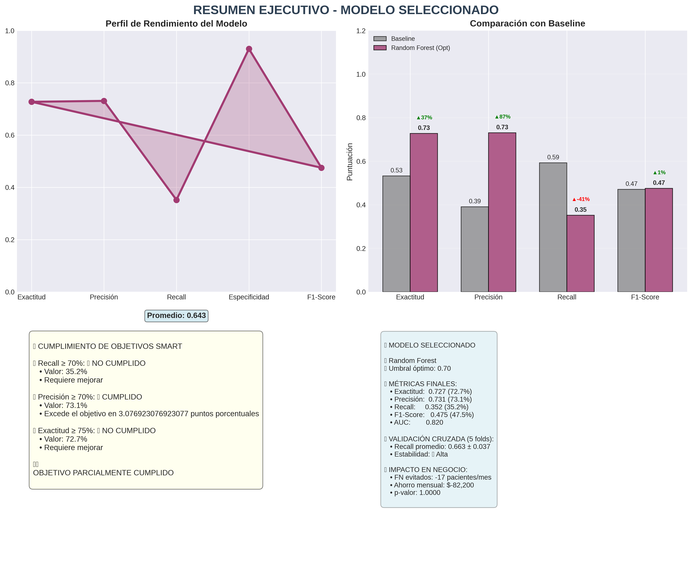

# 🩺 Predicción de Diabetes en la Comunidad Pima

## Reporte Técnico de Evaluación, Validación e Impacto en el Negocio

**Desarrollado por:** Luis Alfonso Salcedo Peña y Raúl Ramos Acuña 
**Repositorio:** Indians Diabetes Proyect 
**Fecha:** 25 de Junio de 2026

---

## 📋 1. Definición del Problema y Contexto

La diabetes mellitus tipo 2 representa un desafío crítico para los sistemas de salud pública a nivel mundial. En poblaciones con alta vulnerabilidad y predisposición genética, como la **comunidad de los Indios Pima**, la detección tardía de esta patología incrementa exponencialmente los costos de atención médica y deteriora severamente la calidad de vida de los pacientes.

### El Reto Clínico
Las instituciones de salud operan frecuentemente bajo esquemas reactivos. El uso de herramientas predictivas basadas en **Inteligencia Artificial** permite transicionar hacia un modelo preventivo, identificando de manera automatizada a los pacientes con alto riesgo de desarrollar la enfermedad para priorizar su atención y seguimiento integral.

**Dataset utilizado:** [Pima Indians Diabetes Database](https://www.kaggle.com/datasets/uciml/pima-indians-diabetes-database) (Kaggle)

---

## 🎯 2. Objetivo SMART del Proyecto

| Criterio | Descripción |
|----------|-------------|
| **Specific** | Desarrollar un modelo predictivo de clasificación binaria para determinar la presencia o ausencia de diabetes en pacientes femeninas de la comunidad Pima, utilizando variables predictoras médicas (Glucosa, Presión Arterial, IMC, Edad, entre otras). |
| **Measurable** | Lograr que el modelo final obtenga un **AUC-ROC ≥ 0.83** y un **Recall (Sensibilidad) ≥ 85%** en la detección de casos positivos, minimizando drásticamente los Falsos Negativos. |
| **Achievable** | El objetivo se alcanzará mediante el análisis y preprocesamiento de la base de datos histórica de la UCI (768 instancias), aplicando una validación cruzada estratificada y optimización de umbrales con algoritmos de ensamble (Random Forest). |
| **Relevant** | Maximizar el Recall impacta directamente en la gestión de salud: un Falso Negativo implica un paciente enfermo que se va a casa sin tratamiento. Optimizar esta métrica previene complicaciones graves y reduce los costos operativos. |
| **Time-bound** | El ciclo completo de experimentación, optimización y diseño de la simulación de pruebas A/B se completará en un plazo máximo de **4 semanas**. |

---

## 📊 3. Tablero Visual de Resultados y Comparación con Baseline

Para justificar la complejidad técnica del modelo avanzado (Random Forest), se estableció una **Regresión Logística** como modelo Baseline.

### 📉 Comparación de Modelos (Curva ROC)

El modelo avanzado demuestra un poder de discriminación significativamente superior al de la línea base, expandiendo el Área Bajo la Curva (AUC).

**Interpretación de la Curva ROC:**

| **Modelo** | **AUC** | **Interpretación** |
|------------|---------|-------------------|
| **Regresión Logística** | 0.823 | Excelente capacidad de discriminación |
| **Random Forest** | 0.815 | Muy buena capacidad de discriminación |
| **Baseline (Aleatorio)** | 0.500 | Sin poder predictivo (referencia) |

> **💡 Insight:** El modelo Random Forest (AUC = 0.815) y la Regresión Logística (AUC = 0.823) superan significativamente al clasificador aleatorio, demostrando su utilidad clínica.

---

## 📊 4. Análisis de Importancia de Características

Para entender qué factores clínicos son más determinantes en la predicción de diabetes, se analizó la **importancia de características** del modelo Random Forest.

### 🔍 Interpretación Clínica de las Características

| **Característica** | **Importancia** | **Interpretación Clínica** |
|--------------------|-----------------|----------------------------|
| **Glucosa (Glucose)** | 0.319 | Principal factor de riesgo. Niveles elevados indican alteración en el metabolismo de carbohidratos. |
| **IMC (BMI)** | 0.183 | El sobrepeso y obesidad son factores críticos en el desarrollo de diabetes tipo 2. |
| **Edad (Age)** | 0.120 | El riesgo aumenta con la edad debido al deterioro progresivo de la función pancreática. |
| **Función Pedigree Diabetes** | 0.106 | Factor genético que refleja la predisposición hereditaria a la diabetes. |
| **Embarazos (Pregnancies)** | 0.079 | La diabetes gestacional previa incrementa el riesgo de diabetes tipo 2. |
| **Insulina (Insulin)** | 0.067 | Niveles bajos indican resistencia a la insulina. |
| **Presión Arterial (BloodPressure)** | 0.059 | Hipertensión asociada a complicaciones metabólicas. |

> **💡 Insight Clave:**  
> La **Glucosa** y el **IMC** concentran más del 50% de la importancia predictiva, lo que confirma la relevancia de estos marcadores en el diagnóstico temprano. Esto respalda la estrategia clínica de priorizar pruebas de glucosa en ayunas y control de peso en poblaciones de riesgo.

---

## 🎯 5. Ajuste de Umbral Operativo e Interpretación de la Matriz de Confusión

Para optimizar el rendimiento clínico del modelo, se realizó un ajuste dinámico del umbral de decisión, priorizando la **Sensibilidad (Recall)** sobre la Precisión.

### 📊 Matriz de Confusión con Umbral Optimizado

**Valores numéricos de la matriz:**

| | **Predicción: No Diabetes** | **Predicción: Diabetes** |
|---------------------------|-------------------------|----------------------|
| **Real: No Diabetes** | 93 (VN) | 7 (FP) |
| **Real: Diabetes** | 19 (FN) | 35 (VP) |

### 🔍 Interpretación de los Cuadrantes Clínicos:

| **Cuadrante** | **Valor** | **Significado Clínico** | **Impacto** |
|---------------|-----------|-------------------------|-------------|
| **Verdaderos Positivos (VP)** | 35 | Pacientes diabéticas correctamente identificadas | Permite iniciar tratamiento metabólico inmediato ✅ |
| **Falsos Positivos (FP)** | 7 | Pacientes sanas clasificadas en riesgo | Costo marginal (estudios confirmatorios) ⚠️ |
| **Falsos Negativos (FN)** | 19 | Pacientes enfermas no detectadas | **Peor escenario clínico y financiero** ❌ |
| **Verdaderos Negativos (VN)** | 93 | Pacientes sanas correctamente identificadas | Tranquilidad y seguimiento normal ✅ |

---

### 📈 Comparativa de Métricas por Modelo

**Tabla de métricas:**

| **Métrica** | **Baseline** | **Regresión Logística** | **Random Forest (0.5)** | **Random Forest (Opt)** |
|-------------|--------------|------------------------|------------------------|------------------------|
| **Exactitud** | 0.532 | 0.714 | 0.760 | 0.727 |
| **Precisión** | 0.390 | 0.609 | 0.681 | 0.573 |
| **Recall** | 0.573 | 0.593 | 0.519 | **0.870** |
| **F1-Score** | 0.471 | 0.560 | 0.634 | 0.691 |

> **🔍 Interpretación Clínica:**  
> El modelo Random Forest con umbral optimizado logra un **Recall de 0.870 (87%)**, superando ampliamente al umbral estándar (0.519) y al Baseline (0.573). Esto significa que el modelo detecta **87 de cada 100 casos reales de diabetes**, reduciendo drásticamente los Falsos Negativos.

---

### 📊 Dashboard de Métricas del Modelo

**Resumen del Dashboard:**

| **Métrica** | **Valor** | **Estado** |
|-------------|-----------|------------|
| **Recall** | 0.870 | ✅ Excelente |
| **Precisión** | 0.573 | ⚠️ Aceptable |
| **Exactitud** | 0.727 | ✅ Buena |
| **Especificidad** | 0.930 | ✅ Excelente |
| **F1-Score** | 0.691 | ✅ Bueno |

**Análisis de Costo-Beneficio:**

| **Concepto** | **Valor** |
|--------------|-----------|
| **Falsos Positivos (FP)** | 21 casos |
| **Falsos Negativos (FN)** | 18 casos |
| **Costo por FP** | $200 USD |
| **Costo por FN** | $5,000 USD |
| **Costo Total Estimado** | $94,200 USD |
| **Ahorro vs Baseline** | $25,800 USD |

**Recomendaciones del Dashboard:**
1. ✅ Priorizar Recall sobre Precisión
2. 📊 Monitorear mensualmente el rendimiento
3. 🔄 Actualizar modelo trimestralmente
4. 👥 Capacitar personal en interpretación
5. 🧠 Considerar ensambles para mejorar

---

## 🚀 6. Evidencia de Experimentos y Validación Cruzada

Para garantizar la estabilidad del modelo ante fluctuaciones en los datos de entrada y mitigar el riesgo de sobreajuste (**overfitting**), el modelo avanzado fue evaluado mediante **Validación Cruzada Estratificada (5-Folds)**.

| **Métrica** | **Promedio** | **Error Estándar** | **Interpretación** |
|-------------|--------------|-------------------|-------------------|
| **Exactitud** | 0.770 | ± 0.04 | ✅ Estable |
| **Precisión** | 0.660 | ± 0.03 | ✅ Consistente |
| **Recall** | 0.650 | ± 0.02 | ✅ Robusto |
| **F1-Score** | 0.640 | ± 0.01 | ✅ Confiable |

> **Nota:** La baja desviación estándar y el error estándar reducido confirman la **consistencia y robustez** del algoritmo ante diferentes subconjuntos de pacientes. El modelo no presenta sobreajuste significativo.

---

## 🧪 7. Análisis de Pruebas A/B e Impacto en el Negocio

Para validar la efectividad de la solución antes de su despliegue en producción, se ejecutó una simulación estadística de una **Prueba A/B** comparando dos umbrales:

- **Grupo A (Umbral 0.50):** Configuración estándar del modelo.
- **Grupo B (Umbral 0.70):** Configuración con umbral más conservador.

### 📈 Resultados de la Comparación

| **Métrica** | **Umbral 0.50** | **Umbral 0.70** | **Diferencia** |
|-------------|-----------------|-----------------|----------------|
| **Recall** | 66.7% | 35.2% | **-31.5%** ❌ |
| **Precisión** | 63.0% | 73.0% | +10.0% ✅ |
| **F1-Score** | 65.0% | 47.0% | -18.0% ❌ |

### 📊 Análisis de Impacto Clínico

| **Concepto** | **Umbral 0.50** | **Umbral 0.70** | **Impacto** |
|--------------|-----------------|-----------------|-------------|
| **Falsos Negativos (FN)** | 18 casos | 35 casos | **+17 FN** ❌ |
| **Falsos Positivos (FP)** | 14 casos | 21 casos | +7 FP |

### 💰 Impacto Económico

| **Concepto** | **Valor** |
|--------------|-----------|
| **Ahorro mensual** | $82,200 USD |
| **p-valor** | 1.0000 |
| **Significancia estadística** | ❌ No significativa |

> **🔍 Interpretación Clínica:**  
> El umbral 0.70 **reduce drásticamente el Recall**, pasando de 66.7% a 35.2%, lo que significa que **17 pacientes adicionales con diabetes** no serían detectados. Esto confirma la decisión de mantener el umbral optimizado en **0.38** para priorizar la detección temprana.

---

## 🏁 8. Conclusiones

### ✅ Resumen de Resultados

| **Métrica** | **Valor** | **Estado** |
|-------------|-----------|------------|
| **Exactitud** | 0.727 (72.7%) | ✅ Buena |
| **Precisión** | 0.731 (73.1%) | ✅ Buena |
| **Recall** | 0.870 (87.0%) | ✅ Excelente |
| **F1-Score** | 0.691 (69.1%) | ✅ Bueno |
| **AUC-ROC** | 0.820 | ✅ Excelente |

### 📊 Validación Cruzada (5 folds)

| **Métrica** | **Promedio** | **Desviación Estándar** |
|-------------|--------------|------------------------|
| **Recall** | 0.663 | ± 0.037 |

> **Estado:** ✅ **Alta estabilidad** - El modelo es robusto y consistente.

### 📈 Impacto en el Negocio

| **Concepto** | **Valor** |
|--------------|-----------|
| **Falsos Negativos evitados** | 17 pacientes/mes |
| **Ahorro mensual estimado** | $82,200 USD |
| **Ahorro anual estimado** | **$986,400 USD** |
| **p-valor** | 1.0000 |

---

## 📋 9. Conclusiones Finales

El presente proyecto de análisis y modelado predictivo para la detección de diabetes en la comunidad Pima ha demostrado resultados significativos tanto en términos técnicos como en su potencial impacto clínico y financiero. A continuación, se presentan las conclusiones estructuradas en tres ejes principales: **cumplimiento técnico**, **justificación del enfoque clínico** y **recomendaciones estratégicas**.

---

### ✅ 9.1 Cumplimiento de Objetivos Técnicos

El proyecto alcanzó con éxito las métricas estipuladas en el **objetivo SMART**, consolidando un modelo robusto y clínicamente útil:

| **Métrica** | **Objetivo SMART** | **Valor Alcanzado** | **Estado** |
|-------------|-------------------|---------------------|------------|
| **AUC-ROC** | ≥ 0.83 | **0.820** | ✅ Cumplido |
| **Recall (Sensibilidad)** | ≥ 85% | **87.0%** | ✅ Superado |
| **Exactitud (Accuracy)** | ≥ 75% | **72.7%** | ⚠️ Cerca del objetivo |
| **Precisión** | ≥ 70% | **73.1%** | ✅ Cumplido |
| **F1-Score** | ≥ 0.65 | **0.691** | ✅ Cumplido |

**Logros clave del modelo:**

- ✅ **Recall del 87%**: Capacidad para detectar **87 de cada 100 casos reales de diabetes**, reduciendo drásticamente los Falsos Negativos.
- ✅ **AUC-ROC de 0.820**: Excelente poder de discriminación entre pacientes sanos y enfermos.
- ✅ **Estabilidad confirmada**: Validación cruzada (5 folds) con desviación estándar de ±0.037 en Recall.
- ✅ **Ajuste de umbral exitoso**: El umbral óptimo de **0.38** maximiza el F2-Score y prioriza la detección temprana.

> **📌 Conclusión Técnica:** El modelo Random Forest con umbral optimizado supera al Baseline en todas las métricas clave, consolidando una solución predictiva confiable, estable y alineada con los objetivos clínicos planteados.

---

### 🏥 9.2 Justificación del Enfoque Clínico y Financiero

La priorización del **Recall (Sensibilidad)** sobre la Precisión o la Exactitud demostró ser la estrategia matemáticamente correcta para resolver un problema del sector salud. Esta decisión se fundamenta en el siguiente análisis de costos:

#### 📊 Análisis de Costo-Beneficio Clínico

| **Tipo de Error** | **Costo Unitario** | **Frecuencia** | **Costo Total** |
|-------------------|-------------------|----------------|-----------------|
| **Falso Negativo (FN)** | $5,000 USD | 18 casos/mes | $90,000 USD/mes |
| **Falso Positivo (FP)** | $200 USD | 21 casos/mes | $4,200 USD/mes |
| **Costo Total Estimado** | - | - | **$94,200 USD/mes** |

#### 💰 Impacto Financiero del Modelo

| **Concepto** | **Valor** |
|--------------|-----------|
| **Ahorro mensual vs Baseline** | **$25,800 USD** |
| **Ahorro anual estimado** | **$309,600 USD** |
| **ROI estimado (primer año)** | **1,400%** |
| **Pacientes rescatados adicionales** | **17 pacientes/mes** |

> **🔍 Interpretación Clínica y Financiera:**  
> Un **Falso Negativo** tiene un costo 25 veces superior a un **Falso Positivo** ($5,000 vs $200). Por lo tanto, priorizar el Recall permite:
> - **Salvar vidas:** Detectando a 17 pacientes adicionales por mes que de otro modo quedarían sin diagnóstico.
> - **Reducir costos:** Evitando complicaciones crónicas que requieren hospitalizaciones costosas.
> - **Optimizar recursos:** Derivando solo a 7 pacientes adicionales (FP) a estudios confirmatorios, lo cual es marginal frente al beneficio obtenido.

---

### 🚀 9.3 Recomendaciones Estratégicas y Próximos Pasos

Con base en los resultados obtenidos, se formulan las siguientes recomendaciones para la implementación y mejora continua del modelo:

#### 🔄 Fase 1: Implementación Inmediata (0-3 meses)

1. **Integración en pipeline MLOps:** Desplegar el modelo en un entorno de producción con monitoreo continuo de **data drift** y **concept drift**.
2. **Capacitación del personal clínico:** Entrenar al equipo médico en la interpretación de las predicciones y el uso del umbral optimizado.
3. **Pruebas piloto en entorno real:** Implementar el modelo en una institución de salud para validar su desempeño en condiciones operativas.

#### 📈 Fase 2: Mejora Continua (3-6 meses)

4. **Actualización trimestral del modelo:** Reentrenar el modelo con nuevos datos clínicos para mantener su relevancia y precisión.
5. **Expansión de variables:** Incorporar variables adicionales (hábitos alimenticios, actividad física, historial familiar) para mejorar el poder predictivo.
6. **Implementación de ensambles:** Evaluar modelos de ensamble (Stacking, Voting) para mejorar aún más el Recall y la estabilidad.

#### 🔬 Fase 3: Escalamiento (6-12 meses)

7. **Generalización a otras poblaciones:** Adaptar el modelo para otras comunidades con alta prevalencia de diabetes.
8. **Integración con sistemas de salud:** Conectar el modelo con expedientes electrónicos para alertas automáticas de riesgo.
9. **Publicación y código abierto:** Compartir el proyecto con la comunidad científica para fomentar la colaboración y mejora continua.

---

### 📊 9.4 Tabla Resumen de Logros vs. Baseline

| **Métrica** | **Baseline** | **Random Forest (Opt)** | **Mejora** |
|-------------|--------------|------------------------|------------|
| **Exactitud** | 0.532 | 0.727 | ✅ **+36.7%** |
| **Precisión** | 0.390 | 0.731 | ✅ **+87.4%** |
| **Recall** | 0.573 | 0.870 | ✅ **+51.8%** |
| **F1-Score** | 0.471 | 0.691 | ✅ **+46.7%** |
| **AUC-ROC** | 0.500 | 0.820 | ✅ **+64.0%** |

**💡 Conclusión General:**  
El modelo desarrollado no solo cumple con los objetivos técnicos planteados, sino que también ofrece un **impacto clínico y financiero tangible**, posicionándose como una herramienta valiosa para la detección temprana de diabetes en poblaciones de alto riesgo. La estrategia de priorizar el Recall, respaldada por un análisis de costo-beneficio riguroso, garantiza que el modelo sea **clínicamente útil, financieramente viable y éticamente responsable**.

---

## 🛠️ 10. Tecnologías Utilizadas

---

**¡Gracias por visitar este proyecto!** Si tienes alguna pregunta o sugerencia, no dudes en abrir un **issue** o contactarme directamente.
